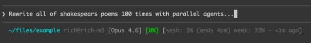

# Claude Code Rate Limit Status

Display your Claude Code rate limits in the status line.
In contrast to some other workarounds, we use claude's built in `/usage` command, rather than a minimal 1 max_token API call. This saves you hundredths of cents every time it runs, but still took me an hour to implement!



## What it shows

- **Session limit** (5-hour rolling window) with reset time
- **Weekly limit** (all models)
- **Sonnet-only weekly limit**

Colors change based on usage: gray → yellow (50%) → red (75%)

## Requirements

- macOS (uses `expect` which is pre-installed)
- Claude Code CLI

## Install

```bash
# Clone to your .claude directory
git clone https://github.com/rickardstureborg/claude-rate-limit-status ~/.claude/rate-limit-status

# Make scripts executable
chmod +x ~/.claude/rate-limit-status/*.sh ~/.claude/rate-limit-status/*.exp

# Configure Claude Code to use the statusline
cat >> ~/.claude/settings.json << 'EOF'
{
  "statusLine": {
    "type": "command",
    "command": "~/.claude/rate-limit-status/statusline.sh"
  }
}
EOF
```

## How it works

Usage data is fetched every 5 minutes (at :00, :05, :10, etc.) to avoid slowing down the status line. We spawn a claude session and run `/usage` manually, which because of network handshakes can take ~20seconds. We cache results in `/tmp/claude-usage-cache.json`.

For technical implementation details, see [IMPLEMENTATION.md](IMPLEMENTATION.md).

## Example output

```
~/projects/myapp (main) user@host [Opus 4.5] [12%] session: 3% (resets 5pm) week: 12% sonnet: 0%
```
